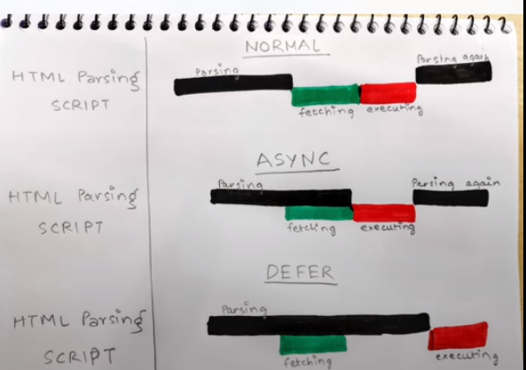

## Tutorial 1

### Emmet
It is used to generate code for you using small syntax selected or typed example type html:5 it automatically generates code for you.
Emmet ia a plugin that uses shot expression to create HTML markups and css

### CDN
- CDN is a distributed group of servers that caches content close to end users. A CDN allows for quick transfer of assets needed for loading html content, including html pages, js files, stylesheets, images and videos.

- It is a network of interconnected servers that speeds up loading web pages for data heavy applications.
- When a user visits a website, data from website server has to travel across internet to reach user's computer.
- It will take long time to load large files. Instead the website content is stored in CDN servers geographically closer to user's computer 

- Purpose of CDN is to reduce latency, reduce delay is communication due to network design .

#### How CDN Works?

##### Caching
Caching is the process of storing multiple copies of same data for faster access

1. A geographically remote website visitor makes the first request for static web content from your site.
2. The request reaches your web application server or origin server. The origin server sends the response to the remote visitor. At the same time, it also sends a copy of the response to the CDN POP geographically closest to that visitor.
3. The CDN POP server stores the copy as a cached file.
4. The next time this visitor, or any other visitor in that location, makes the same request, the caching server, not the origin server, sends the response. 

##### Dynamic acceleration

Dynamic acceleration is the reduction in the server response time to reach dynamic web content requests because of an intermediary CDN server between application and client.

### CDN react
CDN script files are files that are hosted on CDN server and can be accessed by adding script tag to  your html file.

### Cross origin 

### React

1. React element is an object that the browser understands.
2. While it is rendering it converts to dom 

### Difference between library and framework
Why do we call react a library?
- A library can be used on a small portion of a page. So react can work also in a similar fashion.
Other frameworks other than react cannot be applied on a small portion of an application using CDN.

- Both library and frameworks are reusable codes written by someone else which is used in our code, but they are different.
- A library is like Ikea, you have a home ready but yi need to add table which you don't need to build from scratch.
- A framework is like building a new model home. You have a set of blueprints and a few limited choices when it comes to architecture and design
- When you use a library, you are in charge of the flow of the application. You are choosing when and where to call the library. 
- When you use a framework, the framework is in charge of the flow. It provides some places for you to plug in your code, but it calls the code you plugged in as needed.

### Async vs defer

In async the html code are parsed in parallel and script are fetched parallely and as soon as the scripts are available they are executed and html paring stops at the execution time
But in defer the only difference is that scripts are executed only when html paring is completed.

### Why is react called react?
React was developed for applications that have constantly changing data. Since react is a frontend-framework or the view or the "View" in MVC, that means user clicks around and changes the data, the view should react and change with those events

#### Reacting to Changes ⚡
Imagine you have a toy robot. Each time you press a button on the robot, it reacts and does something—like moving its arm or lighting up its eyes. In a similar way, React allows web pages to “react” instantly to user actions without having to reload the entire page.

### Use of crossorigin in script tag
Before talking about CORS, let’s start with cross-origin access. A web document makes a cross-origin access when it requests a resource from a different domain, protocol, or port.

### Difference between React and ReactDOM
React: It is a javascript library used to build better user interfaces.
ReactDOM: ReactDOM glues react to browser DOM.

#### The Split
Why did the React team decide to split React and React-DOM into two different libraries?

Because React-DOM binds the idea of React to a web browser. And ideally, React has nothing to do with a browser or web for that matter. That’s why we’re seeing tools and frameworks like React-Native, React-Three being developed. These tools and frameworks don’t use React-DOM, but they do in fact use the idea behind React.

This is what the team had to say when they were splitting these two libraries

As we look at packages like react-native, react-art, react-canvas, and react-three, it's become clear that the beauty and essence of React has nothing to do with browsers or the DOM.

To make this more clear and to make it easier to build more environments that React can render to, we’re splitting the main react package into two: react and react-dom.

