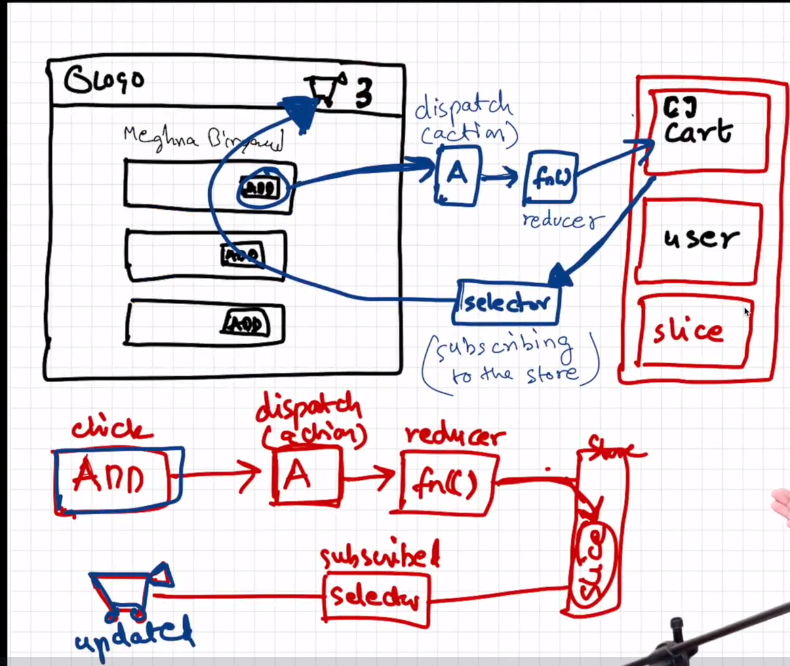
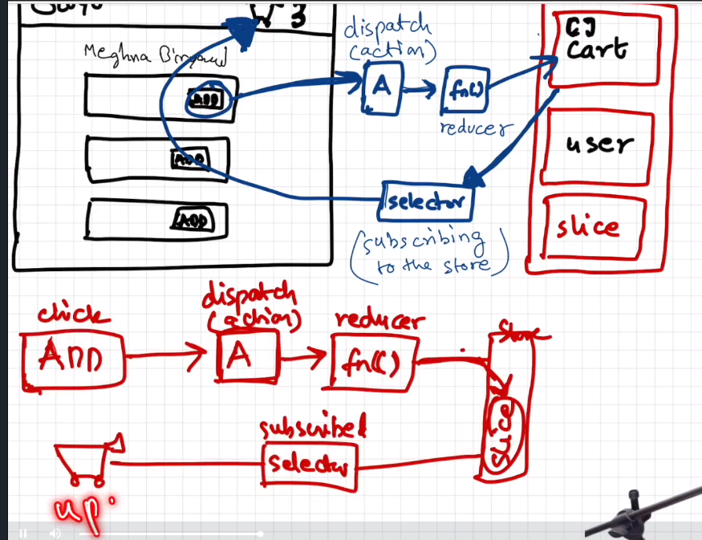

## Tutorial 12

## Redux
Managing state and application data using redux.
- Redux is a state container for react.

### What is state management?

### Redux store



- Redux store acts as a central store for common and major data that can be accesses my all the components.

#### Slices
Parts of redux store (small portion of redux store) are called slices.
Logical partitions to keep data separate.
Ex of slices:
1. Cart slice
2. Cart slice
3. theme

#### To write to store
When we click on add button, ==> it **dispatches** an action ==> it calls a **function** (reducer) => modifies the cart.

#### To read data from store

Cart slice ===> selector (subscribing to the store) ==> cart (count)




### Redux toolkit
- install reduxjs/toolkit and react-redux
- build store
- connect store to app
- create a cart slice
- dispatch action
- selector

1. Create appStore.js - First add appStore, or configure appStore in react using @react/toolkit
2. We need to provide our store to the application, so we will need a provider from react-redux.
3. Wrap the whole app JSP content inside <Provider /> and takes store as a property.
4. When we create a cart slice in a separate file, it returns an object containing:

 ```
    {
        actions: {
            addItem
        },
        reducer
    }
 ```
 5. Add this slice to the store into the reducer.
 6. Add selector (type of a hook) into the header to read the total items in initialState of cart Slice. We will subscribe to the store using selector.

 

What is the difference between
onClick={handleClick}
onClick={() => handleClick(item)}
onClick={handleItem(item)}