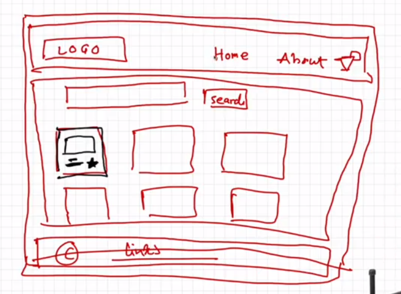

## Components in the app

1. **Header**
- Logo
- nav items
- user Profile

2. **Body**
- Search bar
- cards for restaurants

3. **Footer**
- copyright
- links
- contact information

4. **Card**
- Food image
- restaurants name
- stars

### Config driven UI
That means UI is driven by config. example of zomato API according to location, example offer corousel

### Key warning
If there are components at same level, they should be uniquely represented

### What is the Virtual DOM?
The virtual DOM (VDOM) is a programming concept where an ideal, or “virtual”, representation of a UI is kept in memory and synced with the “real” DOM by a library such as ReactDOM. This process is called reconciliation.

This approach enables the declarative API of React: You tell React what state you want the UI to be in, and it makes sure the DOM matches that state. This abstracts out the attribute manipulation, event handling, and manual DOM updating that you would otherwise have to use to build your app.

### Reconciliation
Reconciliation is the process by which React updates the UI to reflect changes in the component state. The reconciliation algorithm is the set of rules that React uses to determine how to update the UI in the most efficient way possible.

<a href=https://medium.com/javarevisited/react-reconciliation-algorithm-86e3e22c1b40> React reconciliation

### React fiber