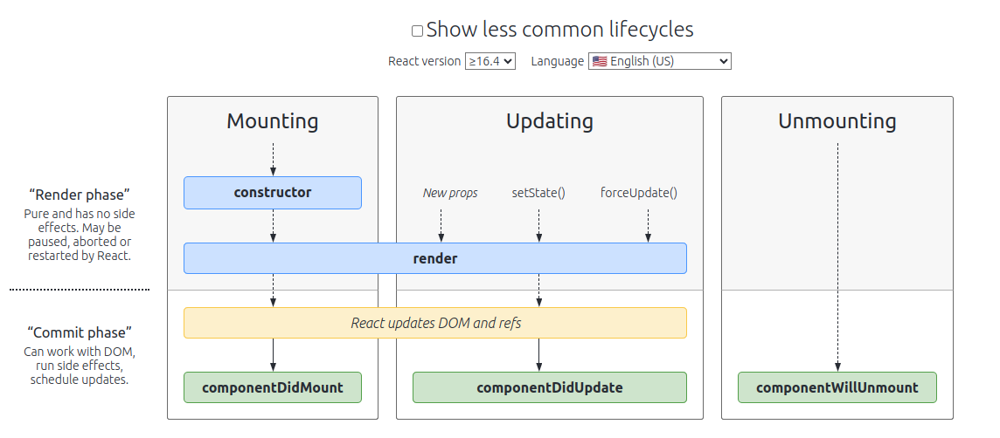

# Class based component
- Class based component is a class that uses render() to return a jsx

## super(prop)

Earlier useState was not present in class based component, we used this.state.

React class based life cycle methods.

Example :
- About us is parent component  is rendered, it goes line by line. It sees component, it then goes to UserClass
- The first thing that loads, 
    - the constructor is called, 
    - So, first constructor then render.
This is how a class is instantiated.

### What happens when the parent is also a class based component.
Sequence:

- Parent Constructor
- Parent Render
- Child Constructor
- Child Render

### ComponentDidMount()
It is used to make API calls.
When a component is loaded 
1. constructor is called. 
2. Render is called 
3. once it is mounted then ComponentDidMount is called

### If we have ComponentDidMount() is called in parent as well.
Sequence:

1. Parent Constructor
2. Parent Render
3. Child Constructor
4. Child Render
5. Child ComponentDidMount
6. Parent ComponentDidMount

We don't want to wait for API call and then render component. We first render the component and then make an API call, and fill the data of API in the component using useEffect() in function based component or ComponentDidMount()

When there are multiple children:
1. Parent Constructor
2. Parent Render
3. Child1 Constructor
4. Child1 Render
5. Child2 Constructor
6. Child2 Render
<DOM manipulation happens here in a single batch (reconciliation happens here)>
7. Child1 ComponentDidMount
8. Child2 ComponentDidMount
9. Parent ComponentDidMount

### Why did child not mount earlier, 
Explained in https://projects.wojtekmaj.pl/react-lifecycle-methods-diagram

React has 2 phases
1. Render
2. commit

- First constructor is called.
- Then render method is called.
- Then the DOM  is updated
- And then ComponentDidMount is called

The reason for all the componentDidMount is called at the end even for the child components, because the api call response wait for one child can lead to delay on the mounting of second child component. That is why mounting is done at the end.
- React will batch the render phase of both children.
- Then he commit phase will be batched together ( Child1 ComponentDidMount, Child2 ComponentDidMount).

When react updates our DOM, React has `componentDidUpdate()`.

So if we have 2 child classes and 1 parent class the sequence will be as follows:

1.  parent constructor
2.  parent render (dummy data)

    `<html dummy>`
3.  A child class constructor
4.  A child class render (dummy data)
    
    `<html dummy>`
5.  B child class constructor
6.  B child class render (dummy data)
     
    `<html dummy>`
7.  A child class componentDidMount
8.  B child class componentDidMount
9.  parent componentDidMount

    `<API call>`

    `setState() was called after mounting cycle is finished so render method will be called again but with api data`
10. parent render

     `<html updated api data>`
11. A child class render

     `<html updated api data>`
12. B child class render

     `<html updated api data>`
13. A child class componentDidUpdate
14. B child class componentDidUpdate
15. parent componentDidUpdate

### componentWillUnmount
- It will be called just before the component is unmounted from UI (removed from UI)
- click to go back to home page: 
    1. Parent class componentWillUnmount
    2. A child class componentWillUnmount
    3. B child class componentWillUnmount